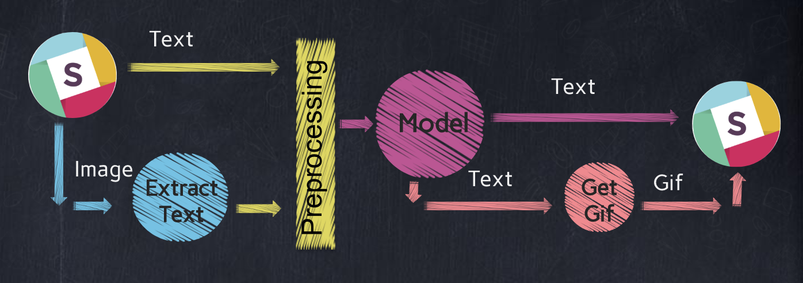

## Chatbot Proposal

##  ¯\ _(ツ)_ /¯ Bot

### Problem Statement
> People by nature like to share happiness and sadness moments with each other. Nowadays with the internet and social media, they tend to share every single moment with their followers including foods, places and feeling, literally everything, so they sacrificed with their privacy just to get feedback and compliments from others.  

>As an unsocial media person and don't like to post my life on the social media, I want a bot is able to handel the normal sentances and response with a reply it can be considr it as human answer not machine answer.

### Datasets and Inputs

>I need a large text dataset to create my bot own vocabulary that should be used to understand and replay to the user.
>For getting the bot training data, there are quite a few resources I could look into. In my project I will use the most popular dataset:

> 1. Cornell movie dialogue corpus
> 2. Reddit comments: I want something that is more raw. so i will try to use Reddit.

> **How to Collect data:**
> 1. Cornell movie dialogue corpus: is available [here](https://www.cs.cornell.edu/~cristian/Cornell_Movie-Dialogs_Corpus.html). it contains 2 files, the first file contains all sentences and corresponding ids. The second file contains the sequence of all conversations as ids.
> 2. Reddit comments : At first,I thought I would use the Python Reddit API Wrapper, but the limits imposed by Reddit on crawling are not the most friendly. To collect bulk amounts of data. Instead, I found a data dump of Reddit Comments separated by month as [JSON files](https://files.pushshift.io/reddit/comments/), after some investigation i found some comments with 1 reply per comment and the other might have many replies, so i decided to go with the top-voted one.
  - [Collect-training-data-Reddit](https://github.com/EsraaMadi/Chatbot/blob/master/code/Collecting%20data/01-Collect-training-data-Reddit.ipynb)

### Solution Statement

>To build my chatbot, i will start by build a large vocabulary which is needed to understand sentences. then i will apply NLP techniques to preprocessing the text and train my model on these preprocessed sentence . I am going to integrate it into my slack so the chatbot could talk to people in real-time.  The bot is guaranteed to **generate** (more or less fluent) sentence, not matching input sentence to get the closest trained answer.

### Benchmark Model

> Indeed, today chatbots are used to solve a number of business tasks across many industries like E-Commerce, Insurance, Banking, Healthcare, Finance, Legal, Telecom.
I have selected an implemented chatbot to be Benchmark Model [slack bot](https://github.com/juliakreutzer/neural-slack-bot)

### Evaluation Metrics
> **User Metrics:** 
> 1. Total Users: This is the most basic metric. It captures the number of people using your chatbot. This matter because its trend shows the change in the number of users and therefore the amount of data your chatbot has been exposed to.
> 2. Active Users: Active users can be defined as the people who read a message in the chatbot in a defined time frame.  

> **Message Metrics:** 
> 1. Conversation Starter Messages: This is the number of messages where you start the interaction by the bot. This critical for measuring the organicness of your platform. It is possible to elicit a response by sending messages to users, but as the time moves forward, companies would need a lower number for that metric.
> 2. Bot Messages: Bot messages are the total number of messages sent by the chatbot in each interaction. This measures the length of a conversation between a customer and the chatbot. We normally want the number of messages to be high, but there is one critical condition, our chatbot needs to respond correctly. In case of misunderstanding or failure to comprehend the input by the user, the chatbot will say similar words repeatedly.

### Project Design

>**EDA (Prepare the Data):** 
>In order to prepare the data for training, we need to use a special script to convert the data to the format which is required in order to train my model.
>1. Creating Dataset:
    - I need to create 2 files, first file with all questions sentances and the second one with suitable response sentences from both movie data and Reddit data
      - [Prepare Reddit data for training](https://github.com/EsraaMadi/Chatbot/blob/master/code/Collecting%20data/02-ii-Training-Data-Files-Reddit.ipynb)
      - [Prepare Movies data for training](https://github.com/EsraaMadi/Chatbot/blob/master/code/Collecting%20data/02-i-Training-Data-Files-Movies.ipynb)
    - By the end of this step , I would have 4 files that will be used of the training and testing:
        - train.from, test.from (chatbot input)
        - train.to, test.to (chatbot output) 
>2. Cleaning Text: (apply on all sentances on both files)
    - Remove punctuations.
    - Remove non English words.
    - Remove urls. 
>3. Creating Vocabulary:
    - The chatbot Vocabulary contains all unique words in my dataset and giving each word an id.  
>4. Converting Observations:
    - Since i have 2 files , one for questions sentences and another for response sentences, I need to convert each word in each sentence to its corresponding id using the above vocabulary. 

>**Explore the Data:** 
>The two datasets store bunch of sentences , and that is something we don't have to explore for now. I already know how the data looks after preparing it. However, it is worthwhile to explore how complex the datasets are. The complexity could suggest how we should approach to get the right result still considering some of restrictions.
  - [Explore the Data](https://github.com/EsraaMadi/Chatbot/blob/master/code/Collecting%20data/03-Explore_Data.ipynb) 

>**Modeling:** 
>In this project, I am going to build a Neural Conversational Model by training a recurrent neural network based chatbot from scratch.I will use Sequence To Sequence model. It consists of two RNNs: An Encoder and a Decoder. The encoder takes a sequence(sentence) as input and processes one symbol(word) at each timestep. Its objective is to convert a sequence of symbols into a fixed size feature vector that encodes only the important information in the sequence while losing the unnecessary information. The decoder takes this fixed size vector and produces a response (word) 

>**Main chatbot functions:** 
>1. Design and build a chatbot using collected data from scratch, that can generate a good text as a result.
>2. Integrated with Slack as an interface for my chatbot.
>3. Chatbot input could be a text or an image (note) , so I am going to use [Google API](https://cloud.google.com/vision/) to extract text from images.
> 4. Chatbot output could be a text or a gif, so I am going to use [GIPHY](https://giphy.com/search/funny-photoshoot) to generate funny gif by passing the main words in the generated text.
> 5. If the score of chatbot output for a given sentence is under the baseline score, The chatbot will respond with ¯\_(ツ)_/¯ 🤷 as a default response 
> 6. **If I have time:** Chatbot could recognize people name in the conversation using [Google API](https://cloud.google.com/natural-language/) then its response depends on the previous conversations about them (maybe I will save the chat history which is related to people and use it to get the response 

>**Model Structure:** 
>

>**Model prediction:** 
>

>**Demo:** 
>
